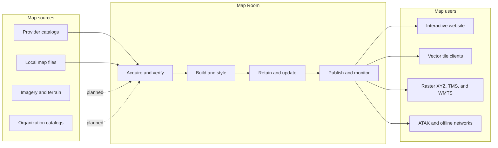

# Map Room

**Map Room is a self-hosted map library and distribution server.**

> **Project status: early preview.** Map Room is rough around the edges, but
> its basic local build-and-serve workflow is usable today. Run it on a trusted
> network, expect breaking changes, and validate generated files on the exact
> ATAK version and device you plan to use. See [current test evidence](TEST_RESULTS.md)
> and the [public release checklist](docs/PUBLIC_RELEASE_CHECKLIST.md).

## See Map Room


| Practical dark themes | Guided ATAK delivery |
| --- | --- |
|  |  |


### Map builds at a glance

The manager keeps the same compact phase path from queue through publication,
while the detail line explains what is happening and what the user should do.

| Waiting for its turn | Downloading with measured ETA |
| --- | --- |
|  |  |
| **Generating vector tiles** | **Actionable failure** |
|  |  |


It is intended to give a person one simple place to choose the maps their team
needs, download or import them, keep them current, preview them in a browser,
and make them available to web, GIS, offline-network, and ATAK users.

Map Room is for situations where depending on a public map service is
undesirable or impossible: field deployments, disconnected networks, private
infrastructure, emergency response, labs, vehicles, and ordinary organizations
that want control of their own map availability.

## What it does



A maintainer should be able to:

1. Open the Map Room website.
2. Search or browse available map sources.
3. Select one or many regions or import a compatible map archive.
4. Review download size, storage needs, capabilities, license, and attribution.
5. Start synchronization and see its phase, progress, rate, elapsed time, and a
   defensible ETA when one can be calculated.
6. Leave Map Room to finish the work and safely resume after a restart.
7. Keep selected maps updated automatically without replacing a working map
   with a failed build.
8. Open any installed map, choose a visual style, and copy or download the
   correct endpoint/configuration for another client.

## What goes in

Map Room is designed around source-provider adapters rather than one map
vendor. Initial version 1 sources are planned to be:

- Geofabrik regional `.osm.pbf` extracts;
- compatible local MBTiles and PMTiles archives.

OpenStreetMap and Geofabrik are initial integrations, not the identity or limit
of the product. The architecture explicitly allows future organization-owned
catalogs, licensed raster maps, COG/GeoTIFF imagery, elevation, terrain, and
other providers. Each source keeps its own format, update, credential, license,
attribution, transformation, caching, and redistribution rules.

## What comes out

Depending on the capabilities of an installed map, Map Room is intended to
publish:

- a simple interactive browser map;
- vector tiles and compatible MapLibre styles;
- server-rendered raster XYZ tiles;
- strict TMS tiles with explicit Y-axis semantics;
- WMTS metadata where supported;
- provenance, freshness, bounds, zoom, checksum, license, and attribution
  manifests;
- versioned ATAK map-source configuration for validated ATAK profiles;
- a fully local serving bundle for networks without internet access.

Not every source supports every output. Map Room must report incompatible
combinations clearly instead of pretending that any map can be converted,
restyled, cached, or redistributed.

## Why it exists

Traditional self-hosted map stacks often assume a knowledgeable GIS/Linux
operator and combine downloading, databases, rendering, caching, serving, and
updates into one difficult-to-maintain system. Map Room separates those
responsibilities while presenting routine operation as a guided product rather
than a collection of infrastructure commands.

Its core safety model is:

- acquire into staging;
- verify the source and its policy;
- build a new immutable artifact;
- validate the artifact and every advertised output;
- atomically publish it;
- retain the last known-good map for rollback.

A failed download, build, validation, or update must never destroy or replace a
working published map.

## Current status

**Map Room is an early preview with a working local compatibility prototype.
It is not a production release.**

The prototype has demonstrated:

- Geofabrik PBF to OpenMapTiles-compatible MBTiles generation with Planetiler;
- vector delivery from native OpenMapTiles data through z14 and crisp
  server-rendered HiDPI raster delivery through z20 via TileServer GL;
- a self-contained MapLibre browser viewer;
- Daylight, Midnight, Dark Blue, Dark Red, Dark Green, Cyberpunk Classic, and
  Cyberpunk Tactical visual themes, all with optional 3D buildings;
- browser preview of the same PNG/XYZ raster route currently generated for
  ATAK configuration;
- one composed browser/ATAK map layer spanning independently managed Florida
  and California archives;
- import of a Map Room publication into a real ATAK client during development;
- operation on an isolated container network with no outbound route.

The prototype has **not** yet validated:

- a recorded ATAK compatibility matrix covering the exact client version,
  device, raster/vector delivery mode, rendering, area caching, and fully
  disconnected behavior;
- strict OSGeo TMS delivery—the current ATAK/browser raster prototype is XYZ;
- the no-expertise maintainer workflow for acquiring new maps from the website;
- automatic acquisition, update, atomic promotion, rollback, and retention;
- authentication, backup/restore, observability, or production packaging;
- any non-Geofabrik source adapter.

Raster zooms 15–20 render the z14 vector archive at progressively closer map
scales. They keep geometry, labels, and symbols sharp, but cannot restore source
features that the z14 tile-generation profile omitted.

See [prototype evidence](TEST_RESULTS.md) for the exact tested boundary.

## Development contract

Map Room uses Spec-Driven Development:

- behavior is specified before implementation;
- every unit of work is a GitHub issue;
- every issue requires explicit Acceptance Criteria and Definition of Done;
- consequential decisions are recorded as ADRs;
- all behavior changes follow the Iron Law: a test must first fail for the
  expected reason, then production code may be written;
- all repository-authored executable production code must maintain exactly
  100% line, statement, function, and branch coverage.

Start with:

- [Specification and planning epic](https://github.com/joshuafuller/map-room/issues/1)
- [Draft specifications and ADRs](https://github.com/joshuafuller/map-room/pull/14)
- [Initial architecture proposal](ARCHITECTURE.md)
- [Prototype evidence](TEST_RESULTS.md)

## Make your own map

The normal map-making workflow is in the website. Start Map Room, select
**Manage maps**, and choose one source:

- browse or search the worldwide regional catalog, grouped by geography;
- upload a local `.osm.pbf` file; or
- enter an HTTPS `.osm.pbf` URL from an explicitly allowed source host.

Map Room distinguishes waiting, downloading, vector-tile generation,
configuration, activation, completion, and failure. Running jobs keep an elapsed
timer visible; measurable downloads show byte and percentage progress; and
failures such as insufficient Planetiler memory include a next action. The
current publication stays live until a replacement succeeds, and the map
library refreshes automatically. Installed maps can be renamed, rebuilt when
their source is reusable, or deleted after typing the exact stable ID.

Catalog availability is not a promise that every area fits the default machine.
Start with a small region to learn the workflow. Large countries or continents
can require substantially more memory, SSD space, and build time; the UI reports
an actionable `MAP_ROOM_BUILD_MEMORY` setting if Planetiler exhausts its heap.

The command-line tool remains available for automation and recovery. For a
compact Rhode Island practice build:

```sh
./scripts/create-map.sh --area "rhode island" --id rhode-island --name "Rhode Island"
```

Then follow [Create your own ATAK map](docs/CREATE_YOUR_OWN_MAP.md) to serve it
over a trusted LAN, import the raster or vector publication, and perform the
required real-device caching and disconnected-use check.

See [ATAK map delivery and file types](docs/ATAK_MAP_TYPES.md) for a plain-language
comparison of raster XML, vector source/style JSON, PBF tiles, and MBTiles
archives.

For the source-traced internals behind those choices, including QR deep links,
tile requests, offline containers, and full Data Package extraction, read
[How ATAK ingests and uses maps](docs/ATAK_MAP_ARCHITECTURE.md).

Product language and onboarding follow the [primary ATAK user persona](docs/USER_PERSONA.md):
assume no GIS background, ask “hosted or completely offline?” first, and reveal
raster/vector details only after that choice.

The tooling builds and validates the server artifact, and a Map Room map has
been imported into ATAK during development. It does not claim that a specific
ATAK version/device/mode combination is validated until that evidence is
recorded reproducibly.

## Run the current prototype

The UI-first workflow requires Docker and internet access while acquiring a new
catalog map. Node.js/npm, Python, `curl`, and `unzip` are only needed for local
development or the command-line preparation tools.

```sh
docker compose up -d --build --wait
```

Open <http://localhost:8088>, choose **Manage maps**, and create the first map.
Map administration currently has no user authentication, so expose it only on a
trusted local network.

For development, start the same local URL with live reload:

```sh
npm run dev
```

The development Compose overlay bind-mounts `web/` and `maintainer/`. Changes
to either restart the manager when needed and automatically refresh an open
browser tab. Stop that stack with `npm run dev:down`. The normal production-like
`docker compose up` workflow does not enable file watching.

On Linux systems whose workspace owner is not UID/GID 1000, pass the owner used
for the bind-mounted `data/` and `styles/` directories:

```sh
MAP_ROOM_UID=$(id -u) MAP_ROOM_GID=$(id -g) docker compose up -d --build --wait
```

Direct HTTPS sources default to `download.geofabrik.de`. Additional trusted
source hosts can be explicitly allow-listed with a comma-separated
`MAP_ROOM_SOURCE_HOSTS` value. Private or organization-owned sources are better
uploaded from a local file than exposed through an unrestricted server-side URL.

The fixture scripts remain useful for development:

Florida is also supported as a larger development fixture:

```sh
./scripts/prepare-fixture.sh florida
```

### Serve multiple installed regions

Map Room can keep multiple regional MBTiles archives online in one process.
Each archive needs a matching manifest named with a stable lowercase ID:

```sh
mkdir -p data/regions
./scripts/write-manifest.py data/florida.mbtiles data/regions/florida.json Florida
./scripts/write-manifest.py data/california.mbtiles data/regions/california.json California
MAP_ROOM_DEFAULT_REGION=california docker compose up -d --wait --force-recreate
```

The live map manager discovers every regional manifest and archive, then
composes them into the same logical map layer automatically. Open
<http://localhost:8088> and use **Map view** to frame all maps, Florida, or
California. This control moves the camera; it does not replace the underlying
layer.

ATAK receives one XML per visual theme and one composed raster endpoint such as
`/styles/all-cyberpunk-tactical/...`. Florida and California therefore remain
part of the same ATAK map layer. Unqualified style URLs remain compatibility
aliases to that same composed map.

Map Room keeps generated vector URLs on the requesting browser origin. For a
stable DNS name, explicitly allow it when starting the stack:

```sh
MAP_ROOM_ALLOWED_HOSTS=maps.example.internal docker compose up -d --wait --force-recreate
```

Unlisted LAN addresses receive safe path-only URLs and still work from mobile
browsers. Do not put a private deployment address into the repository.

### Validate streaming native vectors in ATAK 5.8

This is a device-validation workflow, not yet a claim of validated ATAK
support. Open Map Room from the ATAK device using the server computer's LAN
address, such as `http://SERVER-LAN-IP:8088`; do not use `localhost`, because
the downloaded vector source and selected style point back to Map Room for
PBF tiles, sprites, and glyphs.

Expand **Map controls**, select an individual published map under **Map view**,
then under **Host and stream maps**:

1. Download the small ATAK vector source and selected style JSON files.
2. In ATAK's Import Manager, import `map-room-florida-atak-vector.json`.
3. Find the streamed layer under **Mapbox Vector Tiles** and open its options.
4. Select **Set Layer Style**, choose **Import File**, and select
   the downloaded `map-room-<theme>-atak-vector.json` file.
5. Verify roads, labels, POIs, shields, airports, height-aware buildings, sharp
   zooming, and online PBF requests.
6. Cache a small area in ATAK, disconnect it from Map Room, and separately
   record whether the cached area remains usable.

ATAK 5.8 only probes the first 8 KiB of a candidate streaming descriptor. Map
Room keeps the source JSON below that limit and references ATAK's built-in OMT
schema instead of embedding the full TileJSON field catalog. If ATAK reported
an older source file as unsupported, delete it and download a fresh copy.

The complete MBTiles download remains available as an optional offline path; it
is no longer required for connected use. The current **All installed maps**
browser view composes multiple archives, so it is deliberately not offered as
one remote vector source. Combining selected regions into one ATAK vector layer
requires rebuilding those upstream inputs into one publication rather than
merging SQLite rows.

Preparation downloads source/build inputs and can require substantial time,
storage, memory, and network transfer. Generated data is excluded from Git.

## Verify the prototype

```sh
./scripts/test.sh
./scripts/test-offline.sh
npx playwright install chromium # first browser-test run only
npm run test:browser
npm run test:manager
npm run test:coverage:atak
```

Stop it with:

```sh
docker compose down
```

These checks characterize the prototype. They do not yet satisfy the planned
production-wide 100% coverage gate or real ATAK validation matrix.

## Attribution

Map Room is an independent project. It is not affiliated with or endorsed by
OpenStreetMap, Geofabrik, MapLibre, TileServer GL, Planetiler, or the TAK Product
Center. Maps published through Map Room retain the licenses and attribution
requirements of their sources.

## Community and security

Contributions are welcome; see [CONTRIBUTING.md](CONTRIBUTING.md). Please report
security issues through GitHub's private vulnerability reporting as described
in [SECURITY.md](SECURITY.md). Do not publish private map data, credentials, or
deployment addresses in an issue.

Maintainers preparing to change repository visibility should complete the
[public release checklist](docs/PUBLIC_RELEASE_CHECKLIST.md), including reviewing
the complete Git history and verifying repository settings.

## License

Map Room is available under the [MIT License](LICENSE). Map data and bundled or
downloaded third-party components retain their own licenses and attribution
requirements; see [THIRD_PARTY_NOTICES.md](THIRD_PARTY_NOTICES.md).
