# Map Room

**Self-hosted map creation and distribution for browsers, offline networks, and ATAK.**

> **Early preview:** the basic local build-and-serve workflow is useful today,
> but the project is still rough around the edges. Expect breaking changes, run
> it on a trusted network, and validate outputs on the ATAK version and device
> you intend to use.

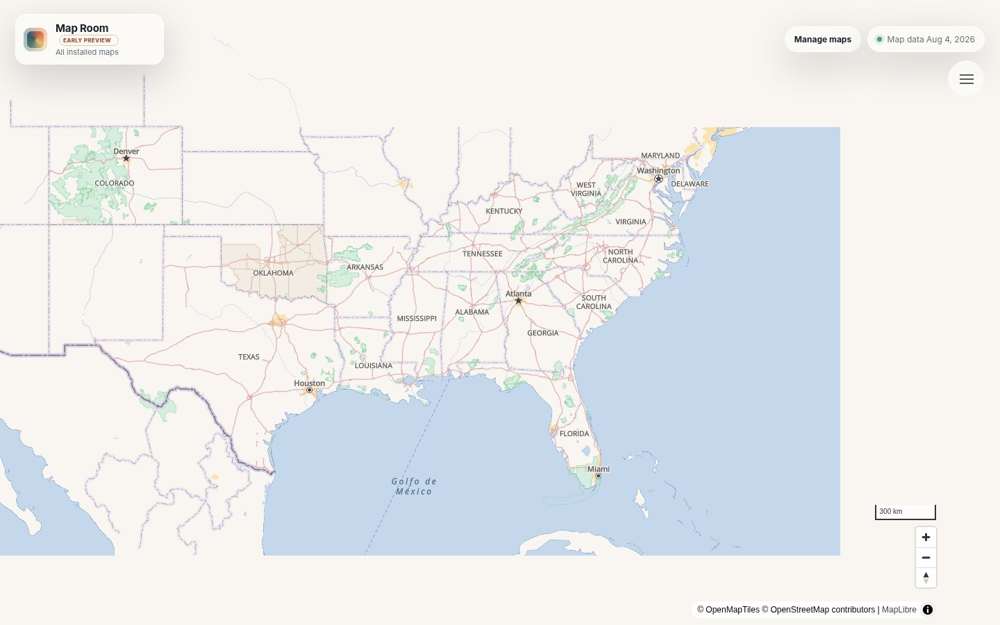

Map Room gives ATAK users and small teams a UI for acquiring regional map data,
building it, applying practical visual themes, and publishing it for connected
or completely offline use. It is designed for people who should not need to be
GIS or Linux experts to make their own maps.

## What it does

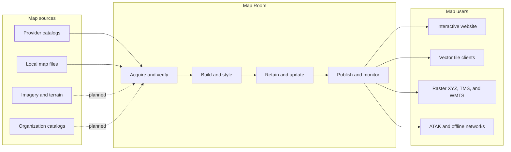

Today, the UI can browse a worldwide Geofabrik catalog, accept compatible local
or trusted remote `.osm.pbf` files, build regional vector-tile archives, manage
installed maps, preview them in MapLibre, and publish vector or rendered raster
routes. Map Room keeps the current map live until a replacement build succeeds.

## Choose how ATAK uses the map

Both workflows are valid. Choose based on whether the ATAK device can reach Map
Room when the map is needed.

| Hosted map | Completely offline map |
| --- | --- |
| ATAK requests tiles from Map Room as you move and zoom. | The map archive is copied to the device before disconnecting. |
| Best when devices have reliable access to a trusted LAN or server. | Best when the device must work with no network at all. |
| Small setup files; one server publication can serve many clients. | Larger transfer and device-storage requirements. |
| Vector streaming is preferred when supported because it is compact and remains sharp. Raster is simpler and broadly compatible. | MBTiles packages the tiles and metadata into one portable SQLite file. Very large archives are better transferred directly than wrapped in an ATAK Data Package. |

Map imagery, vector data, and visual styles are separate resources. ATAK can
consume raster map-source XML, streamed vector source/style JSON, and offline
archives, but those formats are not interchangeable. See
[ATAK map delivery and file types](docs/ATAK_MAP_TYPES.md) before choosing an
output.

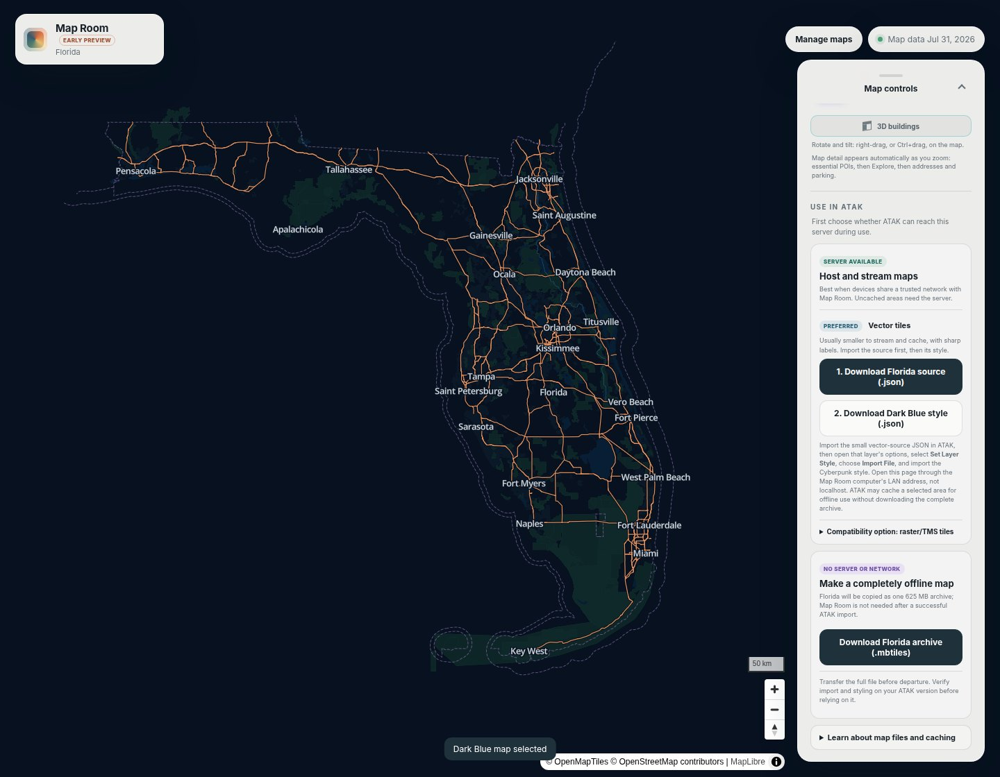

## See it in action

| Daylight with optional 3D buildings | Dark Blue tactical theme |
| --- | --- |
| 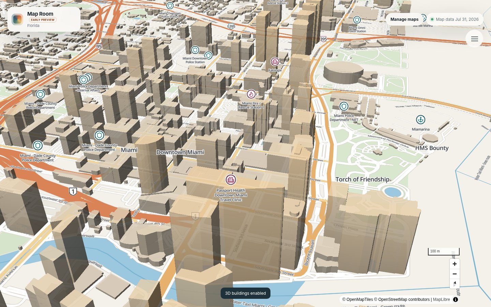 | 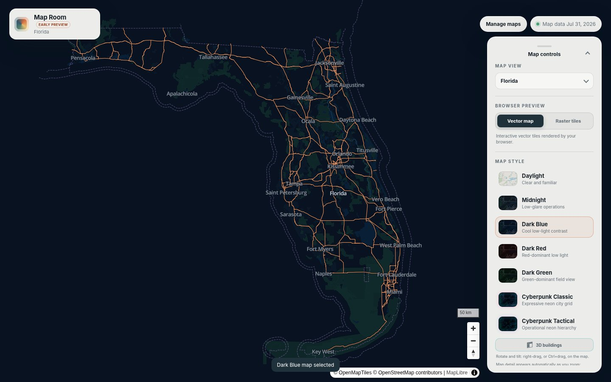 |

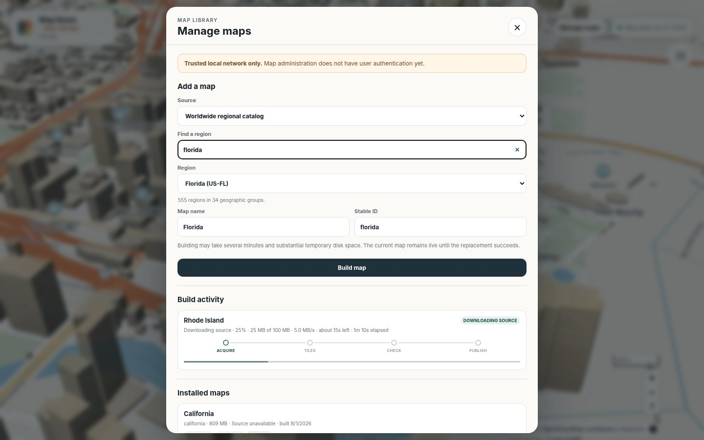

The map manager reports each phase instead of leaving a long-running build as a
black box:

| Queued | Downloading with ETA |
| --- | --- |
| 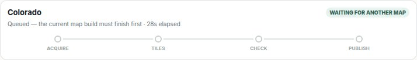 | 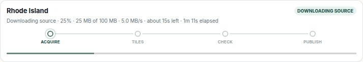 |
| **Building vector tiles** | **Actionable failure** |
| 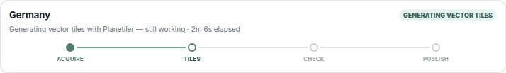 | 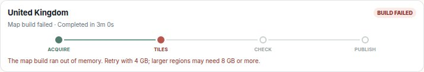 |

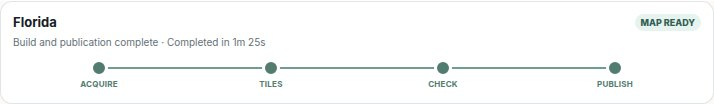

## Quick start

You need Docker and internet access while acquiring a catalog map.

```sh
docker compose up -d --build --wait
```

Open <http://localhost:8088>, select **Manage maps**, and start with a small
region. Large countries or continents can require substantially more memory,
SSD space, download time, and build time.

Map administration does not yet have authentication. Keep the preview on a
trusted local network. To use a hosted map from ATAK, open Map Room through a
device-reachable LAN address or DNS name—not `localhost`.

For hot reload during development:

```sh
npm run dev
```

Stop either stack with `docker compose down`; stop the development overlay with
`npm run dev:down`.

## Make your own map

In **Manage maps**, choose one source:

- browse or search regional catalog entries grouped by geography;
- upload a local `.osm.pbf` file; or
- enter an HTTPS `.osm.pbf` URL from an explicitly allowed source host.

The manager shows queue, download, build, configuration, activation, completion,
and failure status. Installed maps can be renamed, rebuilt when the input is
reusable, or deliberately deleted.

The command-line tools remain available for automation and recovery, but the
normal workflow is UI-driven. Follow
[Create your own ATAK map](docs/CREATE_YOUR_OWN_MAP.md) for the complete build,
serve, import, cache, and disconnected-use procedure.

## Current boundaries

The preview has demonstrated regional PBF-to-MBTiles generation, browser vector
delivery, server-rendered raster delivery, multiple installed regions, seven
themes with optional 3D buildings, a real ATAK import during development, and
operation on an isolated container network.

It has not yet established a recorded ATAK compatibility matrix across client
versions, devices, raster/vector modes, area caching, and disconnected use. It
also lacks authentication, backup/restore, production observability, automatic
source updates, strict OSGeo TMS validation, and non-Geofabrik provider adapters.
Availability in the catalog does not guarantee that an area fits the default
machine.

See [current test evidence](TEST_RESULTS.md) for the exact verified boundary and
the [public release checklist](docs/PUBLIC_RELEASE_CHECKLIST.md) for known
release work.

## Documentation

- [Create your own ATAK map](docs/CREATE_YOUR_OWN_MAP.md) — operator workflow
- [ATAK map delivery and file types](docs/ATAK_MAP_TYPES.md) — hosted versus
  offline, vector versus raster, and common formats
- [How ATAK ingests and uses maps](docs/ATAK_MAP_ARCHITECTURE.md) — source-traced
  QR, import, tile, caching, style, and Data Package behavior
- [Primary user persona](docs/USER_PERSONA.md) — product and onboarding decisions
- [Architecture](ARCHITECTURE.md) — system responsibilities and design
- [Test evidence](TEST_RESULTS.md) — what has and has not been validated
- [Contributing](CONTRIBUTING.md) — development contract, tests, and issue process
- [Security](SECURITY.md) — private vulnerability reporting

## Project policy

Map Room is independent and is not affiliated with or endorsed by OpenStreetMap,
Geofabrik, MapLibre, TileServer GL, Planetiler, or the TAK Product Center. Maps
retain the licenses and attribution requirements of their sources. Do not
publish private map data, credentials, or deployment addresses in an issue.

Map Room is available under the [MIT License](LICENSE). Third-party software and
map data retain their own terms; see [third-party notices](THIRD_PARTY_NOTICES.md).
