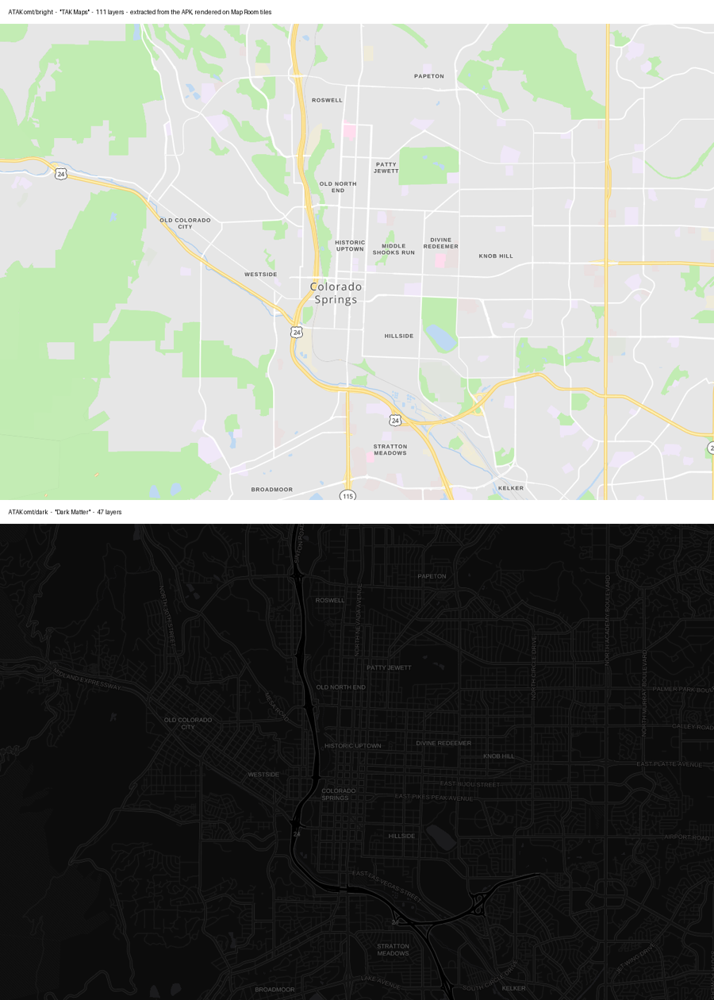

# What ATAK can import, and the styles it ships

Two questions answered from ATAK 5.8.0.1: everything the Import Manager accepts,
and what its built-in map styles actually look like.

## The Import Manager

Reached from the ATAK menu at **`Tools` -> `Import`**. It offers five routes:

| Route | What it takes |
| --- | --- |
| `Local SD` | Browse the device filesystem, tick one or more files |
| `Gallery` | Pick from the media gallery |
| `KML Link` | A URL to a KML network link |
| `HTTP URL` | Adds a *managed remote resource* with optional auto-refresh |
| `Choose App` | Hand off to another app's file picker |

`Local SD` then asks two further questions: **Suggested Import Strategy**
(`Copy`, `Move`, `Use In Place`) and, when more than one handler matches,
**Select Desired Import Method**.

That second prompt is the important one, and it appears only on file routes.
See [ATAK import workflows](ATAK_IMPORT_WORKFLOWS.md) for why a URL never gets
it.

## Everything ATAK will sort

Each import resolver declares an extension and a destination folder under
`atak/`. From `com.atakmap.android.importfiles.sort`:

| Resolver | Extension | Destination | Content |
| --- | --- | --- | --- |
| `ImportLayersSort` | *(sniffed)* | `imagery` | Imagery and map sources |
| `ImportGRGSort` | *(sniffed)* | `grg` | Gridded Reference Graphics, and **any non-terrain `.mbtiles`** |
| `ImportTilesetSort` | `.zip` | `layers` | Tilesets |
| `ImportDTEDSort` / `ImportDTEDZSort` | *(sniffed)* / `.zip` | `DTED` | Elevation |
| `ImportKMLSort` / `ImportKMZSort` / `ImportKMZPackageSort` | `.kml`, `.kmz` | `overlays` | KML overlays |
| `ImportSHPSort` / `ImportSHPZSort` | `.shp`, `.zip` | `overlays` | Shapefiles |
| `ImportGPXSort` / `ImportGPXRouteSort` | `.gpx` | `overlays` | Tracks and routes |
| `ImportGeoJsonSort` / `ImportGeoJsonZSort` | `.geojson`, `.zip` | `overlays` | GeoJSON |
| `ImportGMLSort` / `ImportGMLZSort` | `.gml`, `.zip` | `overlays` | GML |
| `ImportMVTSort` | `.mvt` | `overlays` | Mapbox vector tile |
| `ImportDRWSort` | `.drw` | `overlays` | Drawing |
| `ImportLPTSort` | `.lpt` | `overlays` | Logistics point |
| `ImportMissionPackageSort` | `.zip` | *(package dir)* | Data Package with a `MANIFEST` |
| `ImportCotSort` | `.cot` | *(in place)* | Cursor-on-Target events |
| `ImportCertSort` | `.p12` | `cert` | Certificates |
| `ImportPrefSort` / `ImportJSONPrefSort` | `.pref` | *(prefs)* | Preferences |
| `ImportAPKSort` | `.apk` | `tmp` | Application updates |
| `ImportINFZSort` | `.infz` | *(local repo)* | Product repository |
| `ImportUserIconSetSort` | `.zip` | — | Icon sets |
| `ImportVideoSort` | *(video)* | — | Video |
| `ImportJPEGSort` | *(image)* | — | Imagery with EXIF |
| `ImportSQLiteSort` | `.sqlite` | — | SQLite database |
| `ImportAlternateContactSort` | `.csv` | *(in place)* | Contacts |
| `ImportTXTSort` | *(text)* | *(in place)* | Text |

Note how many resolvers claim `.zip`: Mission Package, tileset, DTED, GML,
GeoJSON, Shapefile and icon set. Which one wins is decided by content, and by
`filterFoundResolvers`, where `ImportGRGSort` promotes itself to the front.

## The styles ATAK ships

ATAK bundles six MapLibre style documents in the APK under `assets/style/`:

| Path | Name | Layers | Sprites |
| --- | --- | --- | --- |
| `omt/bright/style.json` | TAK Maps | 111 | osm-liberty |
| `omt/dark/style.json` | Dark Matter | 47 | own sprite |
| `omt/overlay/style.json` | Google Maps Clone | 111 | osm-liberty |
| `rbt/bright/style.json` | RBT-TLM-DARK-3395 | 204 | own sprite |
| `rbt/dark/style.json` | RBT-TLM-DARK-3395 | 204 | own sprite |
| `rbt/overlay/style.json` | RBT-TLM-OVERLAY-3395 | — | own sprite |

They are ordinary Mapbox/MapLibre style documents. Their bundled sources point
at upstream services — `free.tilehosting.com`, `api.maptiler.com`, and an NGA
development tileserver for the RBT set — but the source is substituted at
runtime with whatever tileset is being drawn.

### Rendered against Map Room's own tiles

`scripts/atak/render-atak-styles.mjs` extracts the styles, repoints them at Map
Room's Colorado vector tiles, and renders them headlessly.



Font stacks are substituted (Map Room serves Open Sans, the styles ask for Noto
Sans); colours, layer rules and sprites are ATAK's own.

The bright render matches what the device produces, which confirms the extracted
document is the one in use.

### How a style is chosen

From `takkernel/engine/src/main/jni/jglvectortiles.cpp`:

```cpp
if(overlay) search.push_back("overlay");
if(ConfigOptions_getIntOptionOrDefault("vector-tiles.dark-default", 0))
    search.push_back("dark");
search.push_back("bright");
for(const auto &sp : search) {
    searchPath << "asset:/style/omt/" << sp << "/style.json";
    if (ProtocolHandler_handleURI(assetStream, sspath.c_str()) == TE_Ok)
        break;
}
```

Three things follow:

1. **The style is chosen by config, not by the tileset.** A `dark-default`
   option exists, so ATAK has a light/dark switch for vector tiles.
2. **Only `style/omt/` is searched here.** The bundled `rbt/*` styles are not
   loaded by this path; RBT tilesets take a different branch that sets
   `autostyle`, and additionally wrap the client in `RBTTileClient`.
3. **The lookup is a URI through a protocol handler.** It resolves `asset:/`
   today, which is why the styles ship in the APK.

### A Map Room style document cannot be supplied — settled

`jglvectortiles.cpp` declares `TAK::Engine::Port::String overrideStyle;` and
then never uses it. The search path is built inline and hardcoded:

```cpp
searchPath << "asset:/style/omt/" << sp << "/style.json";
```

There is no config option, parameter, or URI hook that redirects it, and the
variant is limited to `overlay`, `dark`, `bright`. A stray
`std::ifstream t(sspath)` follows the asset read on the same `asset:` string,
which can never open a file, so it is a no-op rather than an opening.

**In 5.8 a Map Room style document cannot reach the vector renderer.** To give
an offline map a Map Room look, the style must be baked into raster tiles. The
unused `overrideStyle` suggests someone intended otherwise, which makes this
worth re-checking on future ATAK releases.

### Not established

`DeveloperOptions` transfers any `devopts.properties` key prefixed `mapengine.`
into `ConfigOptions`, so `mapengine.vector-tiles.dark-default=1` in
`atak/devopts.properties` should select the dark style. Placing that file and
restarting did **not** change the rendering of an Imagery-registered `.mbtiles`
in testing, and the cause was not isolated. One candidate: an archive registered
through `ImageryScanner` may render through the dataset-raster path rather than
`GLVectorTiles`, and the option only affects the latter.

Attempts so far, and why they were inconclusive:

- `mapengine.vector-tiles.dark-default=1` placed in `atak/devopts.properties`
  changed nothing. `FileSystemUtils.getItem` resolves against
  `Environment.getExternalStorageDirectory()`, so the file was then also placed
  at `/sdcard/devopts.properties`; still nothing changed.
- An attempt to validate the `devopts` mechanism independently, using
  `default-map-projection=3857`, was **not a valid probe**: ATAK renders a globe
  in 3D mode regardless of projection, so the absence of a flat map proves
  nothing either way.

So it remains unknown whether `devopts` is being read at all here. Before any
further work on this, find a developer option with an unambiguous visual effect
and confirm the mechanism itself. The prize is real — a light/dark switch for
offline vector maps at zero extra storage — but nothing about it is established
yet.
