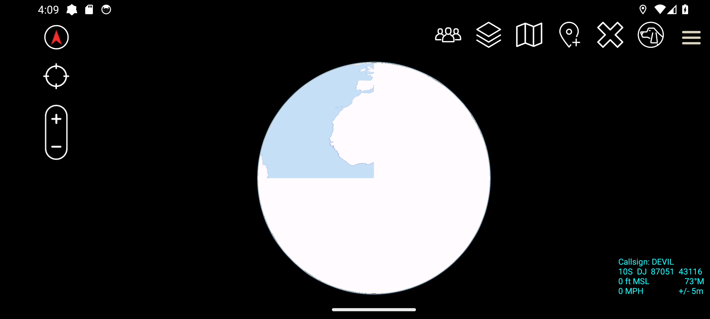
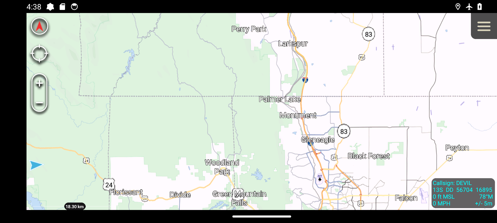
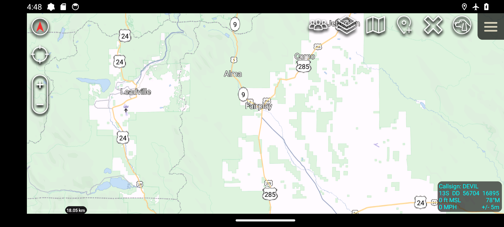
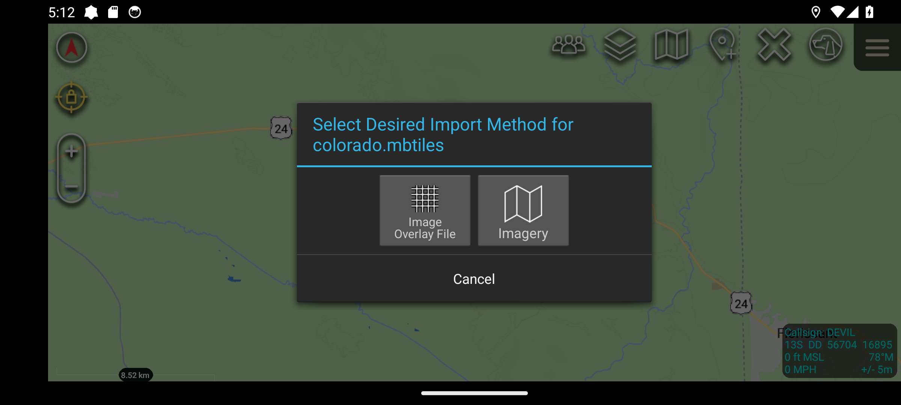
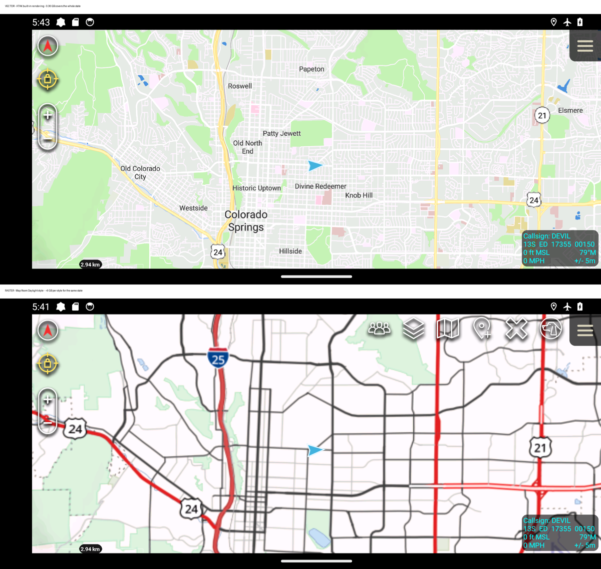
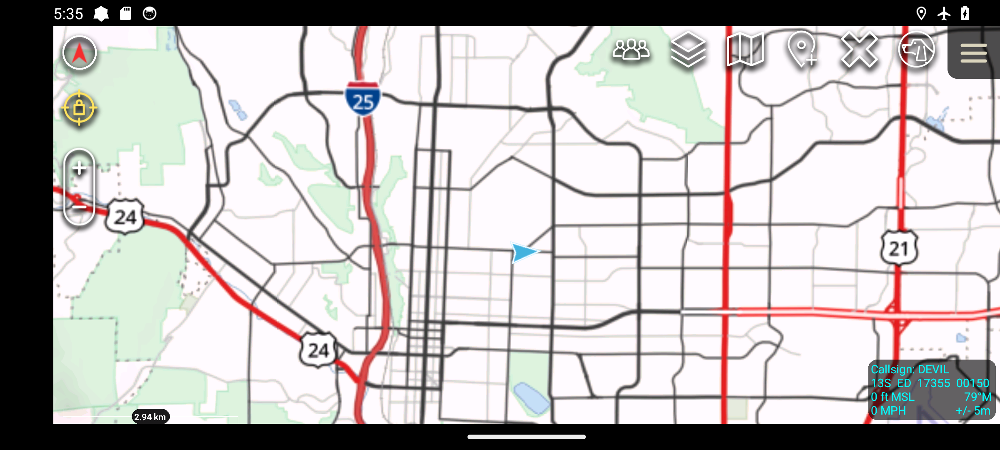
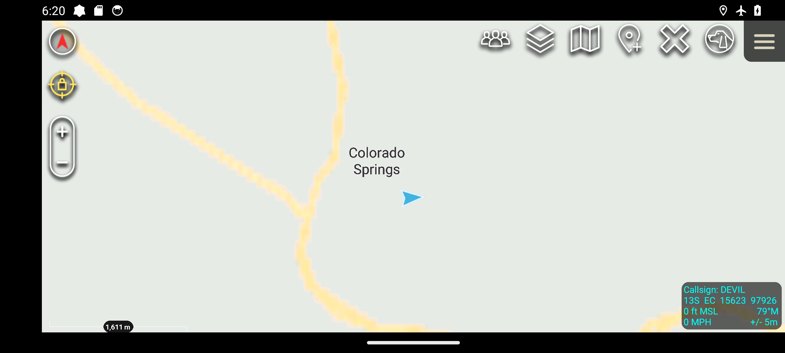

# ATAK import workflows: measured, not assumed

Every step here was executed against a real ATAK build on an emulator and
recorded. Where something has not been tested yet, it says so. Nothing in this
document is inferred from documentation alone.

## Test environment

| | |
| --- | --- |
| ATAK | 5.8.0.1 (9698988) `civ` release, package `com.atakmap.app.civ` |
| Android | 14 (API 34), `google_apis` x86_64 system image |
| Emulator | headless, KVM, 2400x1080 landscape, AVD `maproom_atak` |
| Map Room | served on the host, reached from the emulator at `10.0.2.2:8088` |
| Source | `tak.gov/atak-civ-client` |

### Two environment traps

**The `aosp_atd` system image cannot be used.** It is an Automated Test Device
build with no SysUI. `uiautomator` still reports a full view tree, so a script
can "find" and "tap" buttons and log success while the framebuffer stays black
and nothing advances. Screenshots come back as ~12 KB of solid black. Any
evidence gathered on that image is fiction. Use a full `google_apis` image.

**A control being present does not mean it can be tapped.** ATAK's Permission
Rationale dialog renders its buttons with `clickable="true"` but
`enabled="false"` until the body text is scrolled to the end. A driver that taps
on presence alone will report success indefinitely while the screen never
changes, so `scripts/atak/ui.py` refuses to tap unless `enabled="true"`.

**A rendered map does not identify its source.** Several layers can be active at
once, and a hosted layer and an offline archive of the same region look alike.
Attribute rendering by cutting the network or by checking the server's access
log, never by appearance.

## One-time device setup

These run once per device, before any map work. They are real user steps but
they are not part of the map workflow being optimised, so they are counted
separately.

| Step | Control | Notes |
| --- | --- | --- |
| 1 | `I agree.` | EULA |
| 2 | `I understand` | Permission Rationale — disabled until scrolled to the end |
| 3-9 | `While using the app` x3, `Allow` x4 | Runtime permissions |
| 10 | `Allow all` | Media access |
| 11 | Location settings page | A full Settings screen, not a dialog: select, then Back |
| 12 | `I understand` | File System Access Changes — all-files access |
| 13 | `Done` | TAK Device Setup — server configuration can be skipped |
| 14-15 | `OK`, `Allow` | Battery optimisation hints |

Roughly 15 interactions before a user can import anything.

For automation, two of these were set through adb rather than the UI, and are
therefore **not** measured user steps: 44 runtime permissions via `pm grant`,
and `MANAGE_EXTERNAL_STORAGE` via
`appops set com.atakmap.app.civ MANAGE_EXTERNAL_STORAGE allow`. The latter is a
special app-op that `pm grant` cannot set.

## How ATAK accepts an import by URL

From `ImportExportMapComponent.java` in the ATAK source:

- The receiver acts only when `uri.getHost() + uri.getPath()` equals exactly
  **`com.atakmap.app/import`**. A `tak://com.atakmap.app.civ/import?...` URI
  resolves the activity but is then ignored — the package suffix must not be
  used in the URI.
- The handler's own documentation gives a `.zip` as an example target:
  `tak://com.atakmap.app/import?url=http%3A%2F%2Fwebaddress.com%2Ffile%2Ffile.zip`
- On confirmation, `beginImport()` builds a `RemoteResource` of type
  `INTERNAL_TRANSIENT` and calls `_downloader.download(rr, true)`. ATAK
  downloads the URL itself and passes the result to its import resolvers.
- The intent is delivered to a running instance: ATAK does not need restarting.

## The semantic model: what ATAK does with what you hand it

Understanding this is what lets us design the workflow rather than guess at it.

### ATAK does not "install a map". It sorts a file.

An import is not a map-specific operation. ATAK receives a *file*, then asks its
**import resolvers** which one claims it. A resolver knows an extension, a
destination directory, and a display name. So the question "can ATAK import our
map?" is really "does a resolver claim this file, and does the resolver's
destination make it visible?"

That is why the raster import above works the way it does: the XML is claimed by
the imagery resolver, copied to `/sdcard/atak/imagery/`, and *only then* becomes
selectable. Landing on disk and being usable are the same event here, but they
are two different ideas, and for other file types they can diverge.

### A map source is a pointer, not the map

`daylight.xml` is a `customMapSource` definition: a name, a zoom range, a tile
type, and a URL template. It carries no tiles. ATAK renders by expanding that
template per tile and fetching over the network. Consequences that matter:

- The import succeeds even if the server is unreachable — failure appears later,
  as an empty layer, not as an import error.
- The embedded URL is absolute. It must be an address the *device* can resolve,
  which is why the origin the QR encodes is load-bearing.
- Deleting the map in Map Room does not remove the layer in ATAK; it makes it
  render nothing.

### Two kinds of zip, decided by one rule

From `MissionPackageExtractorFactory.GetExtractor()`:

```
if (HasManifest(zip)) return new MissionPackageExtractor();
else                  return new PlainZipExtractor();
```

`HasManifest` looks for **`MANIFEST/manifest.xml`** inside the zip
(`MissionPackageBuilder.MANIFEST_PATH`). So:

- **Data Package** — a zip *with* `MANIFEST/manifest.xml`. Contents are
  declared, named, and extracted as a described set.
- **Plain zip** — anything else. Extracted and sorted by the same resolvers,
  without declared contents.

Both are importable by URL. The manifest is what turns a bag of files into a
package with an identity ATAK can reason about — which is the mechanism a
"cap pack" of map plus stylesheets would rely on.

### What "streamlined" means, precisely

The user's cost is not downloads; it is **decisions and confirmations**. A single
artifact that ATAK can claim in one confirmation is streamlined even if it is
large. Several small files, each needing its own confirmation and its own
selection, is not. This is the axis to optimise, and it is why bundling is
worth proving rather than assuming.

## Verified: hosted raster map, one style

Deep link used (percent-encoded, host segment exactly `com.atakmap.app`):

```
tak://com.atakmap.app/import?url=http%3A%2F%2F10.0.2.2%3A8088%2Fapi%2Fatak%2Fraster%2Fdaylight.xml
```

| # | Action | Screen | One-time |
| --- | --- | --- | --- |
| 1 | Open the deep link (QR scan is equivalent) | — | |
| 2 | `Yes` | "Import http://10.0.2.2:8088/api/atak/raster/daylight.xml" | |
| 3 | Tap the folded-map icon | Map toolbar | |
| 4 | `OK` | Mobile Imagery hint | yes |
| 5 | `Map Room - Daylight` | Map Source list | |
| 6 | Back | — | |

**Six interactions, two of them one-time.**

Evidence:

- The definition lands at `/sdcard/atak/imagery/daylight.xml`.
- It appears in ATAK's Mobile Imagery list as `Map Room - Daylight`.
- After selection, Map Room served **1,373** tile requests with
  `User-Agent: TAK`, all HTTP 200 — for example
  `GET /styles/all-daylight-raster/3/2/0@2x.png`.
- 

### Origin-aware URLs matter here

The generated XML embeds the tile URL from the requesting origin. Requested as
`localhost`, it embeds `http://localhost:8088/...`, which inside ATAK means the
*device itself* and yields a dead layer. Requested through the address the
device will actually use, it correctly embeds `http://10.0.2.2:8088/...`.
Whatever address the QR encodes must be the address the device can reach.

## Verified: many styles in one file — and the counter-intuitive result

**A Data Package does not register map sources. A plain zip does.** This is the
opposite of what the "cap pack" instinct suggests, and it was established by
running both.

### Attempt 1 — Data Package with `MANIFEST/manifest.xml`: fails

A zip containing three `customMapSource` definitions plus a v2 manifest
declaring each `<Content zipEntry="maps/*.xml">` with
`contentType="Imagery"`, imported via
`tak://com.atakmap.app/import?url=…%2Fmaproom-styles.zip`.

The import is accepted and extracted — the files land at
`/sdcard/atak/tools/datapackage/files/maproom-styles-0001/maps/` — but they are
never sorted into imagery:

```
DirectoryWatcher: (CLOSE_WRITE) filtered by type on .../maps/midnight.xml
DirectoryWatcher: (CLOSE_WRITE) filtered by type on .../maps/daylight.xml
DirectoryWatcher: (CLOSE_WRITE) filtered by type on .../maps/dark-blue.xml
```

The Mobile Imagery list afterwards contained only the previously,
directly-imported `Map Room - Daylight`. **Nothing from the package appeared.**

Note the failure mode: the user sees a successful import and gets no map. There
is no error to act on.

### Attempt 2 — plain zip, no manifest: works

The same two definitions zipped at the archive root with **no** `MANIFEST`
directory, imported the same way. `MissionPackageExtractorFactory.GetExtractor()`
routes a manifest-less zip to `PlainZipExtractor`, which runs the contents
through the normal import resolvers. Both files landed in
`/sdcard/atak/imagery/`, and all three styles then appeared in Mobile Imagery:

```
Map Room - Dark Blue
Map Room - Daylight
Map Room - Midnight
```

### Cost

| Delivery | User cost for *n* styles |
| --- | --- |
| One definition per deep link | 2n interactions, n imports |
| Data Package (`MANIFEST/manifest.xml`) | fails — extracted but never registered |
| **Plain zip of definitions** | **2 interactions, 1 import**, then 1 tap to switch style |

So the streamlined artifact for hosted styles is a plain zip. The manifest —
the thing that makes a zip a "Data Package" — is precisely what breaks it for
this content type.

### Why

`ImportLayersSort` claims imagery by **content sniffing**
(`ImageryFileType.getFileType`), not by extension, and it is reached through the
resolver chain that `PlainZipExtractor` feeds. The Mission Package extractor
places declared contents in its own package directory instead, where the
directory watcher filters them by type and no imagery resolver ever sees them.

## Verified: offline `.mbtiles` renders with no network

Importing Map Room's 356 MB Colorado vector archive by URL:

```
tak://com.atakmap.app/import?url=http%3A%2F%2F10.0.2.2%3A8088%2Fatak%2Fvector%2Fcolorado.mbtiles
```

The archive streams to `/sdcard/atak/tmp/`, is sorted to
`/sdcard/atak/grg/colorado.mbtiles`, and renders offline.

**Proof it is the offline archive and not the hosted source:** with airplane
mode enabled and `10.0.2.2` unreachable, panning to territory never previously
displayed renders full vector detail — Perry Park, Larkspur, Palmer Lake,
Monument, Gleneagle, Black Forest, Peyton, Falcon, I-25 and SH-83 shields, the
Air Force Academy marker, county boundaries and forest polygons.



This isolation matters. A rendered map alone proves nothing about which source
drew it: an identical-looking view with the network up was served by the hosted
raster layer, which logged 707 tile requests while it was on screen. Only
cutting the network attributes rendering to the archive.

### It arrives as an overlay, not a map source

`ImportGRGSort.match()` claims any MBTiles that is not terrain:

```java
if (type.getID() == ImageryFileType.MBTILES) {
    MBTilesInfo mbTilesInfo = MBTilesInfo.get(file.getPath(), null);
    if (mbTilesInfo != null)
        return !Objects.equals(mbTilesInfo.content, "terrain");
}
```

and promotes itself ahead of every other resolver:

```java
@Override
public void filterFoundResolvers(List<ImportResolver> importResolvers, File file) {
    // increase the priority of this sorter vs all of the others
    if (importResolvers.remove(this)) importResolvers.add(0, this);
}
```

So a bare `.mbtiles` is always registered as a GRG. The `.ovr.mbtiles` and
`.ovr.sqlite` suffixes checked earlier in the same method force overlay
treatment more explicitly; they do not opt out of it.

Consequences for the user, all confirmed on device:

- It appears under **Overlay Manager -> Image Overlay**, not in the Mobile
  Imagery list where map sources live.
- Its list entry reports a null-island location (`31N AA 66021 00000`), and the
  entry's zoom-to action moves the map to 0°,0°. The layer itself is bounded
  correctly — centring on Colorado shows its outline box over the state — so
  this is a defect in the list entry, not in the data.
- Import completes in ~70 ms for 356 MB, because tiles are read lazily at
  render time rather than scanned on import.

None of this prevents the map working. It is a discoverability problem: a user
looking for an offline map finds it filed under overlays, labelled with a
location off the coast of Africa.

### Vector support is present

`MBTilesInfo` maps `format = "pbf"` to `content = "vector"`, `GLVectorTiles`
renders content marked vector, and `LayersManager` has a `case "vector"` branch.

## Verified: everything in one archive, one confirmation

A single 340 MB plain zip containing the offline vector archive and all three
style definitions:

```
colorado.mbtiles   356 MB    offline vector tiles
daylight.xml                 hosted style
midnight.xml                 hosted style
dark-blue.xml                hosted style
```

Imported with one deep link and one `Yes`:

```
tak://com.atakmap.app/import?url=http%3A%2F%2F10.0.2.2%3A8099%2Fmaproom-combined.zip
```

Everything registers from that single confirmation:

- `colorado.mbtiles` -> `/sdcard/atak/grg/`, available as an Image Overlay
- all three definitions -> `/sdcard/atak/imagery/`, all three listed in Mobile
  Imagery as `Map Room - Daylight`, `Map Room - Midnight`, `Map Room - Dark Blue`

Confirmed offline: with airplane mode enabled and `10.0.2.2` unreachable,
panning to territory never previously displayed renders Leadville, Alma,
Fairplay, Como, Jefferson, SH-9, US-285 and the Lake County airport from the
archive alone.



### It must be a plain zip

Adding `MANIFEST/manifest.xml` — the thing that makes a zip a Data Package —
breaks it. A manifest routes the archive to `MissionPackageExtractor`, which
places declared contents in its own package directory where the imagery
resolvers never see them. Without a manifest, `PlainZipExtractor` feeds the
normal resolver chain and every file is claimed correctly.

Use a plain zip. Do not add a manifest.

### Total user cost

| | Interactions |
| --- | --- |
| One deep link or QR scan | 1 |
| `Yes` to confirm | 1 |
| Select a style in Mobile Imagery | 1 |

**Three interactions** for an offline map plus three switchable styles, against
2 + 2n for separate definitions and a separate archive.

## What Map Room should publish

One **plain zip** per offering, served over HTTP, referenced by one deep link
that a QR code encodes:

```
tak://com.atakmap.app/import?url=<percent-encoded https url to the zip>
```

Contents, all at the archive root:

| File | Purpose |
| --- | --- |
| `<region>.mbtiles` | offline vector tiles, works with no network |
| `<style>.xml` | one `customMapSource` per style, hosted rendering |

Rules that are not optional, each established by testing:

1. **No `MANIFEST/manifest.xml`.** A manifest makes ATAK treat the archive as a
   Mission Package and the style definitions never register.
2. **Host segment exactly `com.atakmap.app`.** Not `com.atakmap.app.civ`. The
   receiver compares `getHost() + getPath()` literally.
3. **Generate the definitions from the address the device will use.** The tile
   URL is embedded absolutely; a definition generated against `localhost` gives
   the device a dead layer.
4. **Percent-encode the inner URL.**

### The workflow this produces

| Step | What the user does | Result |
| --- | --- | --- |
| 1 | Scan the QR code | ATAK opens with an import prompt |
| 2 | Tap `Yes` | Tiles and every style register |
| 3 | Map icon -> pick a style | Map renders |

Three interactions. The offline tiles work with no network; the styles work
whenever Map Room is reachable.

### The tiles land as an overlay, and delivery cannot change that

Where an `.mbtiles` ends up decides what it becomes:

| Location | What ATAK makes of it |
| --- | --- |
| `/sdcard/atak/imagery/` | A **map source**, listed in Mobile Imagery, selectable as the base map |
| `/sdcard/atak/grg/` | An **Image Overlay**, drawn on top of whatever base map is selected |

Both render, and both work offline. Verified: with the archive placed in
`imagery/`, it appears in the Map Source list as `colorado.mbtiles`
("339.6 MB local"), and selecting it renders Colorado in airplane mode with the
network unreachable.

**Every import route puts it in `grg/`.** This is not something the archive can
influence:

- Imported as a bare file by URL: sorted to `grg/`.
- Imported inside a plain zip: sorted to `grg/`.
- Imported inside a plain zip with the entry path `imagery/colorado.mbtiles`:
  still sorted to `grg/`. `PlainZipExtractor` extracts and then hands each file
  to the resolvers, so paths inside the archive are discarded.

The cause is `ImportGRGSort`, which claims every non-terrain `.mbtiles` and
promotes itself ahead of all other resolvers. Nothing Map Room emits changes
which resolver wins.

### The Import Manager UI lets the user choose, and that is the difference

When more than one resolver matches, `ImportFileTask` can ask which to use —
but only when the caller sets a flag:

```java
if (matchingSorters.size() > 1 && checkFlag(FlagPromptOnMultipleMatch)) {
    promptForUserOrder(finalFile, matchingSorters, isCanceled);
}
```

`ImportManagerView` sets `FlagPromptOnMultipleMatch`. The QR deep-link path does
not — `beginImport()` hands the URL straight to the downloader — so it silently
takes the first matching resolver, which is the one GRG promoted itself to be.

Verified end to end through **Tools -> Import -> Local SD**:

| # | Screen | Choice |
| --- | --- | --- |
| 1 | Select Import Type | `Local SD` |
| 2 | Select Files to Import | browse to the file, `OK` |
| 3 | Suggested Import Strategy | `Copy` (or `Move`, or `Use In Place`) |
| 4 | **Select Desired Import Method** | **`Imagery`** (the alternative is `Image Overlay File`) |



Choosing `Imagery` copies the archive to `/sdcard/atak/imagery/`, leaves `grg/`
empty, and it appears in the Map Source list as `colorado.mbtiles`
("339.6 MB local") beside the style entries — a selectable base map, not an
overlay.

So an offline archive **can** be imported as a map source. It costs a longer
manual path — five screens instead of a scan and a confirmation — and the user
must know to pick `Imagery` at step 4. What cannot currently be done is reaching
that outcome from a QR code, because the deep-link path never offers the choice.

Placement in `/sdcard/atak/imagery/` by USB or file manager produces the same
result and skips the resolvers entirely: `ImageryScanner` walks that directory
and registers whatever `DatasetDescriptorFactory2.isSupported()` accepts — a
separate subsystem from the import resolvers, which is why the routes diverge.

### Known rough edges

Neither blocks the workflow; both should be explained in user-facing guidance
because they will otherwise read as failures.

- **An imported offline map is filed under overlays.** It appears in Overlay
  Manager -> Image Overlay, not in the Mobile Imagery list where map sources
  live. A user looking for "my offline map" among their maps will not find it.
  Placing the file in `/sdcard/atak/imagery/` instead makes it a map source, but
  placement cannot be triggered from a QR code.
- **Its list entry claims to be at 0 deg, 0 deg** (`31N AA 66021 00000`), and
  the entry's zoom-to action moves the map there. The layer is bounded
  correctly; only the list entry is wrong.

Both come from `ImportGRGSort` claiming every non-terrain `.mbtiles` and
promoting itself above the other resolvers. Nothing Map Room emits changes
this.

## Vector against styled raster, same view, both offline



Same viewport, same 2.94 km scale, airplane mode in both. Above: the vector
archive drawn by ATAK. Below: a Map Room Daylight raster archive.

ATAK's vector rendering carries more information at this zoom — neighbourhood
labels, building footprints, parks — while the raster carries Map Room's road
hierarchy and shields.

Size for the same Colorado coverage:

| Format | Size | Styles |
| --- | --- | --- |
| Vector (measured) | 0.36 GB | ATAK's built-in appearance only |
| Raster z0-14 (projected at 43 KB/tile measured) | ~6.0 GB | one style per archive |
| Raster z0-13 | ~1.5 GB | one style per archive |
| Raster z0-12 | ~0.4 GB | one style per archive |

Vector is roughly 17x smaller at full zoom, and does not multiply per style. The
raster totals are tile-count arithmetic against a measured average, not baked
archives.

What ATAK reads from a vector tile, and what can be removed, is in
[the vector tile diet](ATAK_VECTOR_TILE_DIET.md).

## Styles do not apply to an offline vector map

An offline `.mbtiles` and a Map Room "style" are not two halves of one thing.
They are two different maps.

- A **style** (`daylight.xml`, `midnight.xml`, ...) is a `customMapSource`
  pointing at hosted raster tiles. Selecting one offline gives an empty layer.
- The **offline archive** is vector tiles, drawn by ATAK with its own built-in
  appearance.

### ATAK's vector styling is fixed per schema

`GLVectorTiles` maps a tileset's schema to a renderer, and that is the whole of
it:

```java
styleSchemas.put("omt", Arrays.asList(Schema.OMT));
styleSchemas.put("rbt", Arrays.asList(Schema.RBT_CULTURAL, Schema.RBT_PHYSICAL));
...
gltiles = createClientImpl(..., client, isOverlay, !Objects.equals(style, "omt"), ptr);
```

`Schema.java` hardcodes OMT and RBT as fixed layer and field maps. Nothing in
the vector-tile path loads a style document — there is no sprite, glyph, or
`style.json` handling in it. The `style` variable is a schema name, not a
stylesheet.

Map Room publishes OMT-schema tiles, so an offline archive renders with ATAK's
built-in OMT appearance. **There is no way to supply a different one.**

### Verified: a styled raster archive works offline

Baked 164 tiles of Map Room's Daylight raster over the Colorado Springs area,
zoom 6-12, into a 7.1 MB `.mbtiles` with `format = png` and correct bounds
(`scripts/atak/make-raster-mbtiles.py`).

Placed in `/sdcard/atak/imagery/`, it appears in the Map Source list as
`daylight-cos.mbtiles` ("7.1 MB local"). Selected, with airplane mode enabled
and `10.0.2.2` unreachable, it renders Colorado Springs in the Daylight style —
I-25 and US-24 shields, street grid, parks — visibly different from ATAK's
built-in vector appearance.



So an offline map **can** carry a Map Room style. The style is applied when the
archive is baked, not on the device.

### What this means for offline style choice

Switching appearance offline cannot be done by shipping more style documents.
The options are:

1. **Accept ATAK's look offline.** One archive, one appearance, smallest size.
2. **Ship raster tiles per style.** Raster archives carry their appearance baked
   in, so `daylight.mbtiles` and `midnight.mbtiles` would each be a separate
   selectable offline map. This multiplies storage by the number of styles and
   raster is far larger than vector for the same coverage.
3. **A plugin.** Out of scope for a map server to require.

Option 2 is the only route to offline style switching with stock ATAK, and it
is proven to work. Its cost is size, and only a small sample has been measured:
164 tiles over roughly 0.9° x 0.5° at zoom 6-12 came to 7.1 MB. Each further
zoom level roughly quadruples tile count, and each style is a separate archive.
A state-sized region at operational zoom has not been measured and must be
before any size is promised.

## No URL import can produce a map source

`ImportFileTask` prompts the user to choose a resolver only when the caller sets
`FlagPromptOnMultipleMatch`. Every call site that sets it in `ImportManagerView`
is a **file** path — an activity result, a Local SD multi-select, and a Local SD
single file with an import strategy.

URL imports do not go through those. They use the shared downloader, built once:

```java
_downloader = new ImportFileDownloader(mapView.getContext(),
        ImportRemoteFileTask.FlagNotifyUserSuccess
                | ImportRemoteFileTask.FlagUpdateResourceLocalPath);
```

No prompt flag. That same `_downloader` serves both the QR deep link
(`ImportExportMapComponent:1220`) and the Import Manager's `HTTP URL` option
(`:795`), so both take the first matching resolver — which for any non-terrain
`.mbtiles` is `ImportGRGSort`, because it promotes itself.

**Consequence: an offline archive delivered by any URL always becomes an Image
Overlay.** Reaching the map list requires a file already on the device, imported
through `Local SD` and answering `Imagery`, or placed in `atak/imagery/`
directly. A QR code cannot produce a map source, and no change to what we
publish alters that.

## Capping zoom loses detail; ATAK does not fill it in

Built a z0-12 copy of the Colorado archive (6,964 tiles, 47 MB against 309 MB
for z0-14) to test whether a shallower archive can be over-zoomed.

It cannot. At 1,611 m scale — past the archive's maxzoom — only a blurred
arterial and the `Colorado Springs` label render. No street grid, no buildings.
The full z0-14 archive shows the complete street network at a *wider* 2.94 km
scale.



Two things combine: ATAK scales the deepest available tile rather than
re-rendering, and OMT does not carry minor streets at z12 in the first place.
The detail is absent from the data, so nothing can recover it.

Zoom depth is therefore a real product trade, not a packaging trick:

| Archive | Size | What the user gets |
| --- | --- | --- |
| z0-12 | 47 MB | Regional context; no street detail |
| z0-13 | 118 MB | Intermediate |
| z0-14 | 309 MB | Full street detail |

## Cost compared

| Delivery | Interactions for a map plus *n* styles |
| --- | --- |
| One definition per deep link, archive separately | 2 + 2n |
| Data Package with a manifest | styles never register |
| **One plain zip** | **3** |

## Not yet verified

Listed explicitly so nothing here reads as settled:

- Whether a vector source and its style can be delivered together, and whether
  the style's sprite and glyph URLs resolve on a disconnected device.
- Whether any *import* route can land an archive in `imagery/`. Bare file,
  plain zip, and path-prefixed zip all sort to `grg/`. Placement works but is
  not deliverable by QR.
- Whether the Import Manager's `HTTP URL` option also prompts for the resolver.
  If it does, a URL-delivered archive can reach the map list and only the QR
  path skips the choice.
- The size of a raster `.mbtiles` per style for a real region, which decides
  whether offline style switching is affordable at all.
- Whether the per-layer palette control ATAK shows on overlays offers any
  meaningful appearance change for a vector tileset.
- The practical size ceiling. 356 MB imports and renders. The 20 MB figure in
  #63 is a Mission Package *send* warning threshold, and the working path is not
  a Mission Package, so that threshold may not apply at all — but this is
  untested. Confirm before promising it for a multi-gigabyte region such as
  `us-south` (3.6 GB).
- Whether the download survives interruption, and what a partial transfer leaves
  behind.
- Whether re-importing an archive updates an existing map or duplicates it.

## Reproducing

```sh
# Full system image; the ATD image cannot render.
sdkmanager --install "system-images;android-34;google_apis;x86_64"
avdmanager create avd -n maproom_atak -k "system-images;android-34;google_apis;x86_64" -d pixel_6 --sdcard 4096M
emulator -avd maproom_atak -no-window -no-audio -no-boot-anim -gpu swiftshader_indirect -memory 4096 -partition-size 8192

adb install -r ATAK-5.8.0.1-9698988-civ-release.apk   # full civ build ships x86_64; civSmall is arm64-only
python3 scripts/atak/first-run.py                      # walks setup, logs every screen and tap
```
