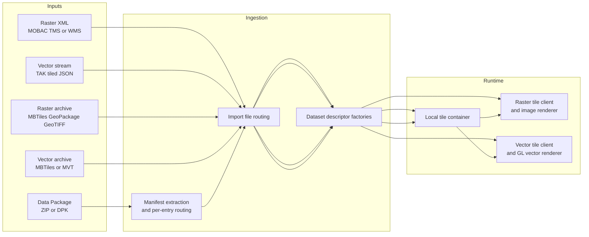
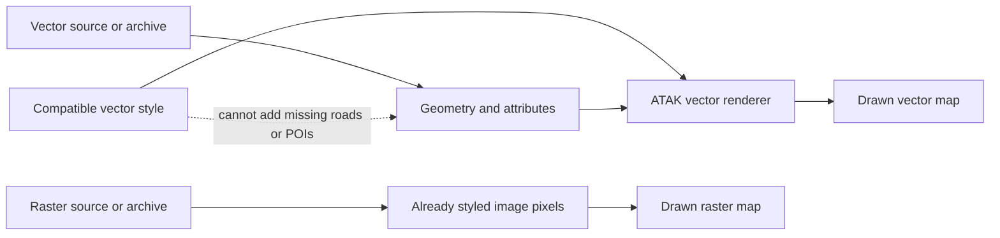
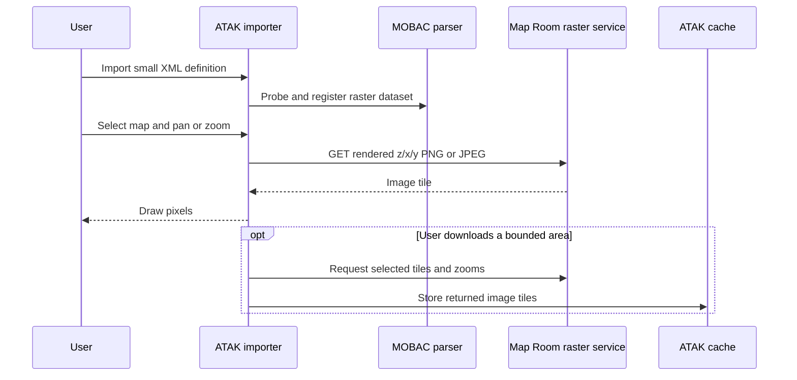
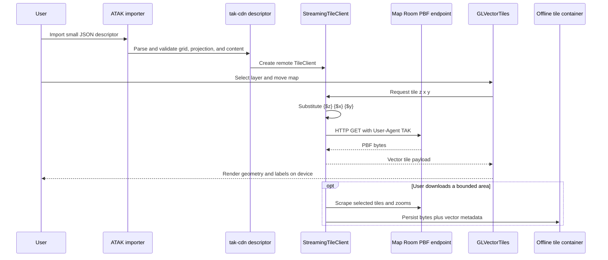
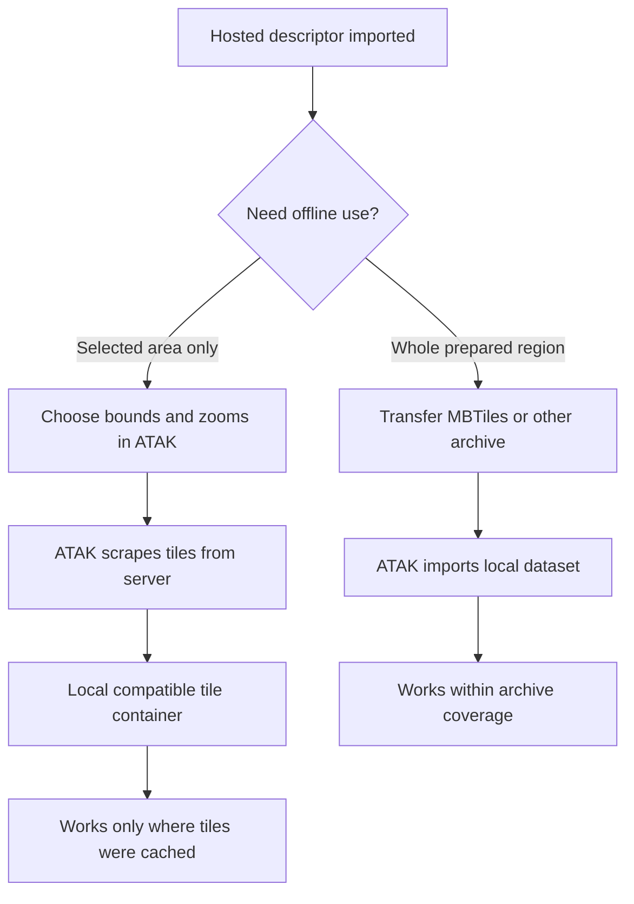
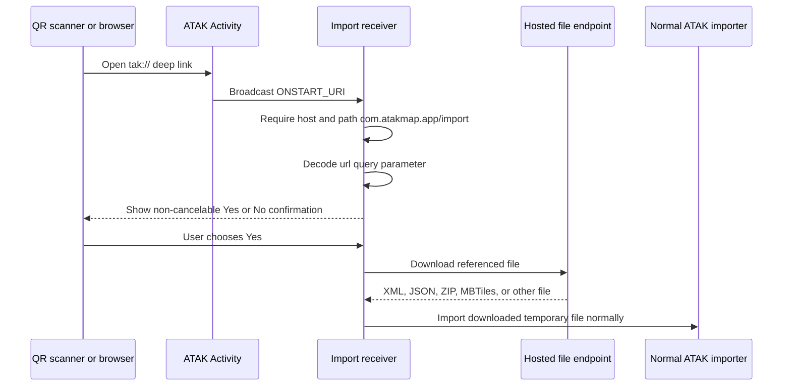
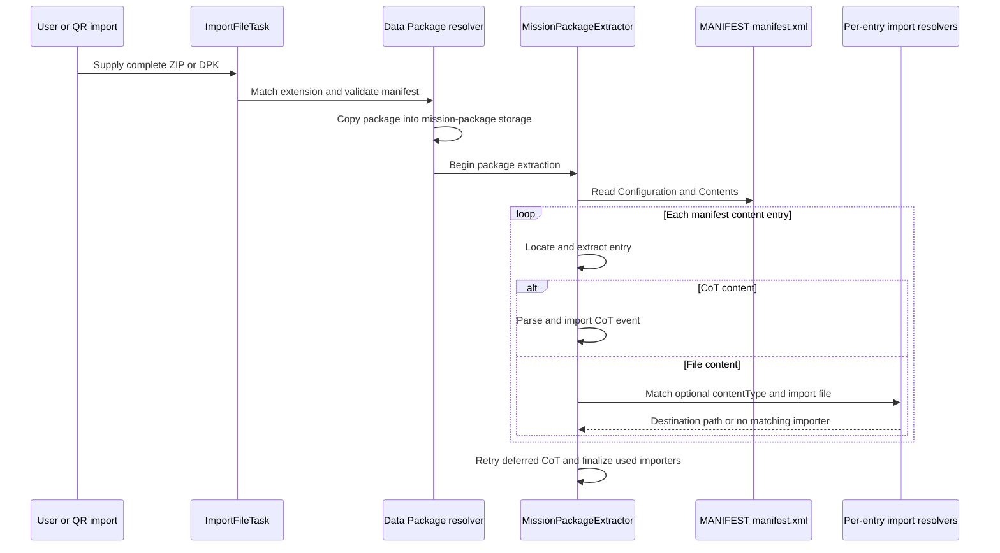

# How ATAK ingests and uses maps

This is Map Room's source-grounded guide to ATAK map delivery. It exists so
that product decisions do not depend on repeating source archaeology.

The primary source is the public ATAK client repository at commit
[`17deb7e1aeb51cc499ff385986853f5b293d3604`](https://github.com/TAK-Product-Center/atak-civ/commit/17deb7e1aeb51cc499ff385986853f5b293d3604),
identified by that repository as ATAK 5.5.1.11. Practical raster-map and QR
conventions were compared with
[`joshuafuller/ATAK-Maps` at `93c6cf2a45609b2e275e07270113277faa1d591d`](https://github.com/joshuafuller/ATAK-Maps/commit/93c6cf2a45609b2e275e07270113277faa1d591d).

## Evidence boundary

This guide uses three evidence labels:

- **Source-observed** means the behavior is directly visible in the pinned
  ATAK source. It does not prove that every released ATAK build or Android
  device behaves identically.
- **Development-observed** means a Map Room map has been imported into a real
  ATAK client during development. The exact version, device, delivery mode,
  cache coverage, and disconnected result have not yet been recorded as a
  reproducible compatibility matrix.
- **Device-validated** requires a recorded ATAK version, Android version,
  device, Map Room commit, input, expected result, and actual result. No path
  in this guide should be read as device-validated unless it says so.

Line numbers below apply to the pinned ATAK commit. Paths begin at the
`atak-civ` repository root.

## Mental model: how ATAK maps work

ATAK does not have one universal "map file." It recognizes a source or file,
routes it through an appropriate parser/importer, records a dataset, and then
selects a renderer based on the dataset and its metadata.



The important product split is:

| Delivery | Small import is | Runtime payload | Network after import | Offline boundary |
| --- | --- | --- | --- | --- |
| Hosted raster | XML source definition | PNG/JPEG image tiles | Required for uncached tiles | Only explicitly cached areas and zooms |
| Hosted vector | JSON tiled-content descriptor | PBF vector tiles | Required for uncached tiles | Only explicitly cached areas and zooms |
| Offline raster | MBTiles/GeoPackage/other supported dataset | Local image tiles | Not required | Coverage inside the imported file |
| Offline vector | Vector MBTiles/MVT | Local vector tiles | Not required | Coverage inside the imported file |
| Data Package | ZIP/DPK plus manifest | Whatever files it contains | Depends on those files | A wrapper is not automatically an offline map |

### Recognition is content-aware, not extension-only

ATAK builds a list of import resolvers and asks which ones match. Mission
Packages are checked before the broad imagery resolver, and the imagery
resolver is intentionally placed near the end because it can match many
formats (`ImportFilesTask.java:390-495`). The imagery resolver checks known
types such as MBTiles and GeoPackage, probes tiled JSON, and finally asks the
dataset descriptor factories whether they support the file
(`ImportLayersResolver.java:84-132`).

The raster type registry includes GeoTIFF, MrSID, JPEG 2000, DTED, ECW, KML,
KMZ, GDAL-readable data, RPF, GeoPackage, MBTiles, MOMAP, and GeoPDF
(`ImageryFileTypeBase.java:24-61`). This is an ingestion inventory, not a
promise that every variant, projection, compression, or device works.

## Maps and imagery are not styles

These are separate product objects even when a UI makes them feel like one:

| Object | Contains | Can work alone? | Changes map data? |
| --- | --- | --- | --- |
| Map/imagery source | Location, grid, bounds, zooms, attribution, and tile payload access | Raster: yes. Vector: it can load, but may use a default or automatic appearance. | Yes; it determines which tiles/features exist. |
| Offline map/archive | The tile payloads and metadata themselves | Yes, within its coverage, if ATAK supports the archive | Yes; it supplies the actual local tiles. |
| Style | Rules for colors, widths, labels, icons, visibility, filters, and sometimes sprites/glyphs | No; it needs compatible vector data and matching source-layer/property names. | No; it only changes presentation. |



For raster, the server or archive producer has already applied the style and
encoded the result as image pixels. ATAK cannot independently recolor a road
or hide a label that is baked into a PNG. Importing a different raster XML
usually selects a differently rendered endpoint; it is not applying a client
style to the same pixels.

For vector, the PBF tile contains geometry and attributes. The renderer needs
rules that match the tile schema. A style can hide or emphasize features that
exist, but it cannot recover data omitted by the tile-generation profile.
Likewise, importing a style JSON does not import a map source, tile archive,
or offline coverage.

In the pinned ATAK snapshot, `GLVectorTiles` recognizes OpenMapTiles (`omt`)
and RBT schema metadata and selects renderer behavior accordingly
(`GLVectorTiles.java:66-70,90-158,321-350`). Its native renderer loads bundled
OMT `bright`, `dark`, or `overlay` style assets for recognized OMT content
(`takkernel/engine/src/main/jni/jglvectortiles.cpp:31-81`). This is distinct
from Map Room's separately generated style JSON. The exact external-style UI
and its compatibility with each Map Room theme still require a recorded test
against the target ATAK release.

## Raster sources

### Hosted MOBAC XML

ATAK supports the small XML definitions commonly called MOBAC map sources.
The parser recognizes `customMapSource`, `customWmsMapSource`, and
`customMultiLayerMapSource` (`MobacMapSourceFactory.java:80-104`).

- `customMapSource` describes a tiled image service. `name`, `url`, and
  `maxZoom` are required; the parser also accepts minimum zoom, server parts,
  Y inversion, coordinate system, background color, and update behavior
  (`MobacMapSourceFactory.java:138-229`).
- `customWmsMapSource` describes WMS and causes ATAK to construct image
  requests from the layer, style, version, coordinate system, and bounds
  (`MobacMapSourceFactory.java:319-468`).
- `customMultiLayerMapSource` composites child raster sources
  (`MobacMapSourceFactory.java:235-311`).



The XML is a pointer, not the map. Styling is performed by Map Room before
the tile is sent, and the device receives pixels. This makes raster delivery
the simpler compatibility option but usually increases transfer and storage
for comparable coverage.

The `ATAK-Maps` project uses this model in practice: its map definitions are
MOBAC XML, and its installation guidance either places those definitions in
`atak/imagery/mobile/mapsources/` or delivers them through ATAK's importer.
That is useful field evidence, while the ATAK parser remains the authority for
the accepted XML structure.

### Raster archives

An MBTiles file is a SQLite tile container, not inherently a vector format.
Its metadata and tile payload determine whether it contains image or vector
tiles. ATAK also recognizes raster GeoPackage and other georeferenced imagery
through its dataset factories. A local raster archive is self-contained for
its encoded coverage; no hosted service is needed after successful import.

## Streamed vector tiles

ATAK's current tiled-content path uses a small JSON descriptor parsed by
`StreamingTiles`. Despite the Java class name, this path accepts both
`"imagery"` and `"vector"` content
(`StreamingContentDatasetDescriptorSpi.java:42-60,127-133`). ATAK calls its
dataset provider type `tak-cdn` (`StreamingContentDatasetDescriptorSpi.java:33-38`).

For Map Room, the significant descriptor fields are:

| Field | Meaning in the pinned ATAK source |
| --- | --- |
| `schema` | Major versions through 5 are accepted; versions above 1 use semantic `major.minor.patch` form (`StreamingTiles.java:104-121`). |
| `title` | Display name for schema versions above 1 (`StreamingTiles.java:123-127`). |
| `url` | Required tile URL template (`StreamingTiles.java:128`). |
| `downloadable` | Permits an offline-cache location and area scraping (`StreamingTiles.java:131`; `StreamingTileClient.java:304-357`). |
| `srs` | Must resolve as `EPSG:<number>` for this descriptor path (`StreamingContentDatasetDescriptorSpi.java:51-60`). |
| `bounds` | Optional projected dataset bounds (`StreamingTiles.java:134-143`). |
| `invertYAxis` | Converts between top-origin and bottom-origin tile rows (`StreamingTileClient.java:204-208`). |
| `isQuadtree`, `numLevels` | Allow ATAK to construct an implicit tile matrix for supported grids (`StreamingTiles.java:173-213`). |
| `content` | `vector` selects vector tile handling; the default is `imagery` (`StreamingTiles.java:216-222`). |
| `mimeType` | Payload type metadata, such as Mapbox vector tile PBF (`StreamingTiles.java:220-222`). |
| `metadata` | Carries renderer hints, including `styleSchema` (`StreamingTiles.java:224-235`; `GLVectorTiles.java:321-350`). |

Map Room currently publishes schema `4.0.0`, Web Mercator, a quadtree starting
at zoom zero, `content: "vector"`, the Mapbox vector-tile MIME type, and
`metadata.styleSchema: "omt"`.

### What happens after descriptor import



The tile client replaces `{$x}`, `{$y}`, and `{$z}`, adds `User-Agent: TAK`,
optionally configures an authentication handler, and accepts a successful HTTP
response body as tile bytes (`StreamingTileClient.java:204-261`). The
descriptor file itself therefore imports quickly; PBF transfer happens later
as the user views or caches coverage.

The descriptor SPI marks the dataset with `contentType=vector` and creates an
offline-cache path when the source is downloadable
(`StreamingContentDatasetDescriptorSpi.java:84-123`). `GLVectorTiles` opens
the remote client or a local tile container only when its metadata says the
content is vector, and it recognizes OpenMapTiles and RBT schemas for renderer
selection (`GLVectorTiles.java:74-159,309-350`).

This makes vector the preferred Map Room path when the target ATAK release
renders it correctly: PBF carries geometry and attributes rather than repeated
image pixels. It is not automatically offline, and renderer/style
compatibility remains more version-sensitive than a server-rendered PNG.

### Vector style is a separate concern

There are two related mechanisms in the inspected client:

1. Tiled-content metadata can identify a known schema such as `omt`, allowing
   the vector renderer to choose built-in behavior (`GLVectorTiles.java:66-70,
   95-111,321-350`).
2. ATAK includes a Mapbox GL style-sheet parser, but support is not identical
   to every MapLibre/Mapbox Style Specification feature. Map Room therefore
   generates a reduced ATAK-oriented style JSON rather than assuming its web
   style is portable without changes.

Importing a vector descriptor, selecting or importing a style where the target
ATAK release permits it, and verifying that the result looks correct are
separate acceptance steps. The local source proves vector rendering and
style-sheet parsing code paths; it does not prove that every Map Room theme or
external-style workflow is device-validated.

## Offline tile containers and MBTiles

Area caching and importing a complete archive are different workflows.



When `downloadable` is true, `StreamingTileClient.cache()` creates a compatible
container and runs `TileScraper` for the requested area and resolutions
(`StreamingTileClient.java:304-363`). Metadata such as `content: vector` is
written into the target container so it can be reopened with the correct
renderer (`StreamingTileClient.java:337-347`). That cache contains only what
the user requested.

For MBTiles, ATAK reads the metadata table and treats `format=pbf` as vector
content (`MBTilesContainer.java:228-313`). The file-type registry accepts
`.mbtiles`, `.mvt`, and `.btis` suffixes in its MBTiles category
(`ImageryFileTypeBase.java:327-356`). A separate MVT resolver parses `.mvt`
and `.mbtiles` as Mapbox vector-tile feature data
(`ImportMVTResolver.java:11-41`). Consequently, extension alone is not enough
to predict the winning importer; metadata and parser support matter.

An `.osm.pbf` is not any of these. It is compressed OpenStreetMap source data
used by Map Room's build pipeline. A tile `.pbf` is one vector tile. A vector
`.mbtiles` is a SQLite database holding many tile PBF blobs and metadata.

## QR and Add to ATAK

A QR code is only a visual encoding of a TAK deep link. It does not contain a
map, tiles, or a Data Package.

The exact accepted shape visible in the pinned source is:

```text
tak://com.atakmap.app/import?url=https%3A%2F%2Fmap-room.example%2Fatak%2Fmap.json
```

The nested download URL must be fully percent-encoded. ATAK's own source
comments show the same pattern for ZIP and GeoTIFF downloads
(`ImportExportMapComponent.java:1156-1162`). `ATAK-Maps` independently uses
the same URI form for its Add to ATAK links and locally generated QR codes.



The Android manifest exposes ATAK's activity for browsable `tak:` VIEW
intents (`atak/ATAK/app/src/main/AndroidManifest.xml:230-245`). The activity
passes the URI through the `ONSTART_URI` broadcast. The import receiver checks
for `com.atakmap.app/import`, reads the `url` query value, and asks the user to
confirm (`ImportExportMapComponent.java:1164-1211`). On Yes, it creates an
`INTERNAL_TRANSIENT` remote resource and starts the downloader
(`ImportExportMapComponent.java:1213-1221`).

The downloader stores the response temporarily, uses HTTP content type to add
a recognized extension when possible, and then sends transient downloads to
`ImportFileTask` (`ImportFileDownloader.java:109-229,232-303`). The file at the
inner URL therefore has to be reachable from the Android device and valid for
a normal ATAK importer.

Map Room QR onboarding should therefore:

- generate the QR locally and provide the same URI as a tappable Add to ATAK
  action;
- use the device-reachable LAN/DNS origin, never `localhost`;
- show the exact host and artifact type before scanning;
- fully encode the nested URL and never place credentials in it;
- prefer small hosted XML/JSON definitions for quick onboarding;
- treat a QR pointing at a large archive as a download shortcut, not as data
  embedded in the QR; and
- preserve ATAK's confirmation step rather than promising silent import.

## Full Data Package ingestion

ATAK calls these Mission Packages or Data Packages. The pinned resolver accepts
`.zip` for version 1 and `.dpk` for version 2 and assigns content type
`Data Package` with MIME `application/zip`
(`ImportMissionPackageResolver.java:16-69`).

A well-formed package is a ZIP containing `MANIFEST/manifest.xml`. The manifest
has required `Configuration` and `Contents` elements and a version attribute
(`MissionPackageManifest.java:59-84,136-139`). Strict package matching checks
for that manifest (`MissionPackageCallback.java:39-51`). ATAK also has a
non-strict fallback for an otherwise unclaimed ZIP, but Map Room should create
an explicit manifest rather than depend on that heuristic.



`MissionPackageExtractor` rejects a missing or invalid manifest, reads every
declared content entry, separates CoT events from files, imports CoT in two
passes, and finalizes any file resolvers used
(`MissionPackageExtractor.java:41-183`). For each regular file,
`MissionPackageEventHandler2` extracts it under package storage, honors an
optional manifest `contentType`, asks all matching import resolvers to handle
it, and records the resulting local path
(`MissionPackageEventHandler2.java:82-134,146-220`).

This produces several practical rules:

- ATAK downloads the entire package before the import begins. A QR does not
  make a large package lightweight or resumable.
- A package can contain small hosted map definitions, styles, attachments,
  CoT objects, or offline archives. The behavior after extraction comes from
  each contained file's importer.
- Packaging a hosted XML/JSON definition does not make its referenced tiles
  available offline.
- Packaging a huge MBTiles archive duplicates the burden of transferring and
  temporarily storing a large ZIP. Map Room should prefer an explicit,
  size-visible transfer workflow for large offline artifacts.
- The previously discussed roughly 10–20 MB package range remains an
  operational caution, not a universal hard limit proven by this source.
  Device and transport testing must set any actual limit.

## What Map Room should publish

Map Room should present one operating-condition choice first and formats
second:

| User goal | Primary publication | Supporting artifacts | ATAK action |
| --- | --- | --- | --- |
| Hosted, smallest routine transfer | TAK tiled vector descriptor | PBF endpoint; ATAK-compatible style where needed | Add/import descriptor, validate style, optionally cache an area |
| Hosted, simplest display | MOBAC raster XML | Rendered PNG XYZ endpoint | Add/import XML, select source, optionally cache an area |
| Completely offline region | Vector MBTiles with correct metadata | Style guidance and checksum | Transfer full file, import, verify disconnected |
| Install several small definitions together | Manifested Data Package | XML/JSON/style files, not huge tile archives | Download full package, extract, then use each imported definition |

The UI and documentation must never collapse these into one ambiguous
"download map" action. Every artifact should state:

1. whether it contains map data or only points to a server;
2. vector or raster payload;
3. total size before transfer;
4. whether Map Room must remain reachable;
5. the offline coverage boundary;
6. expected ATAK import path; and
7. the latest recorded device-validation result.

## Source index

All ATAK references below are at commit
`17deb7e1aeb51cc499ff385986853f5b293d3604`:

- `atak/ATAK/app/src/main/AndroidManifest.xml:230-245` — browsable `tak:` intent.
- `atak/ATAK/app/src/main/java/com/atakmap/android/importexport/ImportExportMapComponent.java:1156-1221` — TAK import URI, confirmation, and remote import start.
- `atak/ATAK/app/src/main/java/com/atakmap/android/importfiles/http/ImportFileDownloader.java:109-303` — download and normal importer handoff.
- `takkernel/engine/src/main/java/com/atakmap/map/layer/raster/mobac/MobacMapSourceFactory.java:80-468` — raster XML formats.
- `takkernel/engine/src/main/java/com/atakmap/map/formats/cdn/StreamingTiles.java:88-241` — tiled JSON schema.
- `takkernel/engine/src/main/java/com/atakmap/map/formats/cdn/StreamingContentDatasetDescriptorSpi.java:23-138` — tiled dataset registration and cache metadata.
- `takkernel/engine/src/main/java/com/atakmap/map/formats/cdn/StreamingTileClient.java:44-373` — tile HTTP requests and area caching.
- `takkernel/engine/src/main/java/com/atakmap/map/layer/feature/vectortiles/GLVectorTiles.java:64-350` — vector renderer selection and schema hints.
- `takkernel/engine/src/main/java/com/atakmap/map/layer/raster/ImageryFileTypeBase.java:24-61,327-356` — recognized imagery categories and MBTiles suffixes.
- `takkernel/shared/src/main/java/gov/tak/api/importfiles/ImportLayersResolver.java:84-132` — external layer routing.
- `takkernel/shared/src/main/java/gov/tak/api/importfiles/ImportMissionPackageResolver.java:16-100` — ZIP/DPK package recognition.
- `atak/ATAK/app/src/main/java/com/atakmap/android/missionpackage/file/MissionPackageExtractor.java:41-183` — manifest extraction loop.
- `atak/ATAK/app/src/main/java/com/atakmap/android/missionpackage/event/MissionPackageEventHandler2.java:82-220` — contained-file importer dispatch.

Re-run this archaeology and update the pinned commit, line ranges, and
behavioral notes when Map Room changes its supported ATAK baseline.
